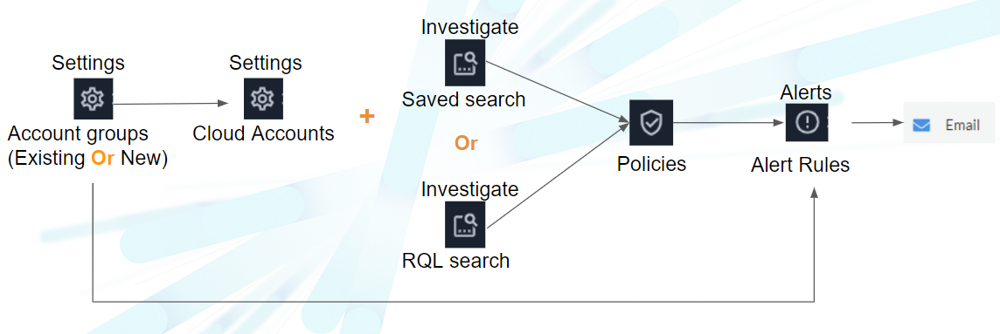

# Terraform_module
How to use module in Terraform, here is an example of a VPC with VPC flowlogs activated and 2 EC2 Instances

# Design AWS

# Design Prisma

# Requirements
- 1°)Install Terraform
- 2°)Go ACloudGuru through Okta => Playground => Start AWS Sandbox
- 3°) Modify you credentials file with your access key secret key for [default] and create the same with [acloudguru]
- 4°) Create your own .pem key in repository "Terraform_module"
- 5°) In your file variables.tf ==> Modify variables "tfstate_bucket_name" , "dynamodb_name", "key_name", "filename", "myIP" with your own value.

# Deployement
- 1°)  Remote state
- go to Terraform_module/stacks/00_remote_state
- terraform init
- terraform plan 
- terraform apply -auto-approve

- 2°) VPC
- cd ../01_vpc
- terraform init
- terraform plan 
- terraform apply -auto-approve

- 3°) EC2
- cd ../02_ec2
- terraform init
- terraform plan 
- terraform apply -auto-approve

 4°) Prisma Onboard account
- modify variables into variables/variables.tf ##Prisma##
- add your own prismacloud_auth.json in the repo "03_prisma_onboard_account"
- cd ../03_prisma_onboard_account
- terraform init
- terraform plan 
- terraform apply -auto-approve

 5°) Prisma New policy
- add your own prismacloud_auth.json in the repo "04_prisma_new_policy"
- cd ../04_prisma_new_policy
- terraform init
- terraform plan 
- terraform apply -auto-approve

 6°) Prisma Alert rule
- add your own prismacloud_auth.json in the repo "05_prisma_prisma_alert_rule"
- cd ../05_prisma_prisma_alert_rule
- terraform init
- terraform plan 
- terraform apply -auto-approve

