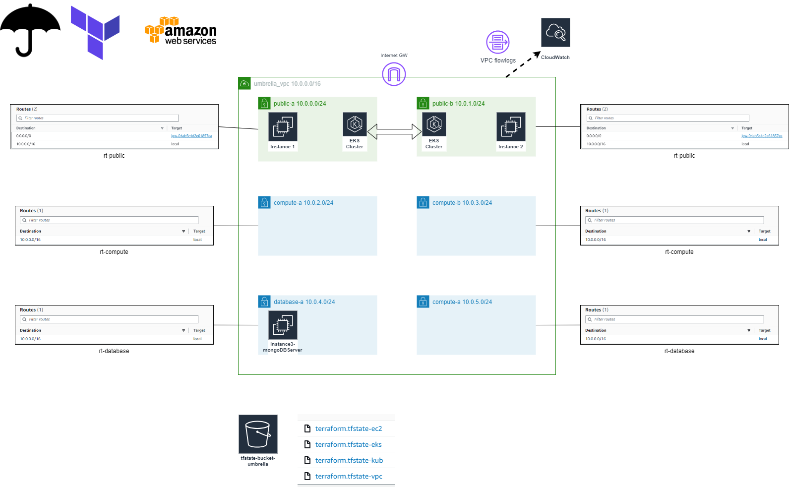

# Umbrella Game
This repository aims to deploy the infrastructure necessary to perform a game to learn the use of Prisma Cloud

# Umbrella Retailer

# Umbrella-AWS design

# Umbrella-Prisma design 

# Requirements
- 1°) Windows Env
- 2°) 1 AWS Account with Access key & secret key in ./aws  [default]
- 3°) Install Terraform + Terragrunt
- 4°) Create your own umbrella-instance.pem key in repository "02_ec2"
- 5°) In your file variables.tf ==> Modify variables "myIP" , "aws_account_id_1", "notification_recipients" with your own value.

# Deployement
- run powershell script rename_randomly.ps1
- terragrunt run-all apply

# Commands

aws eks update-kubeconfig --region us-east-1 --name Umbrella-EKS-Cluster-xxxx

$ kubectl get all

terragrunt run-all apply

Set-ExecutionPolicy -Scope Process -ExecutionPolicy Bypass